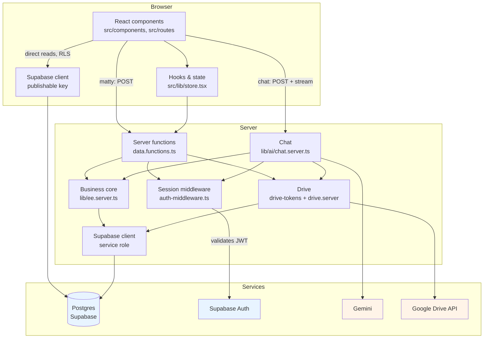
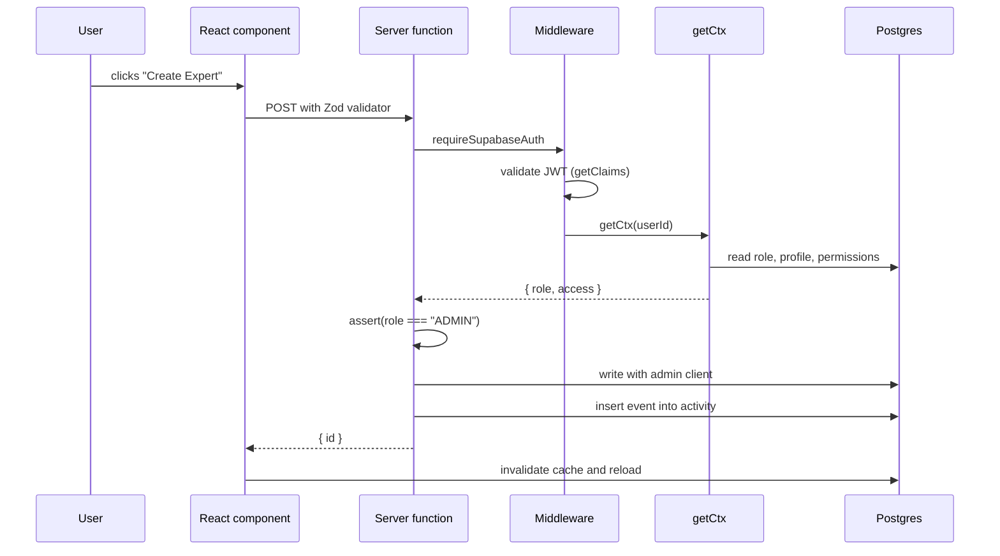
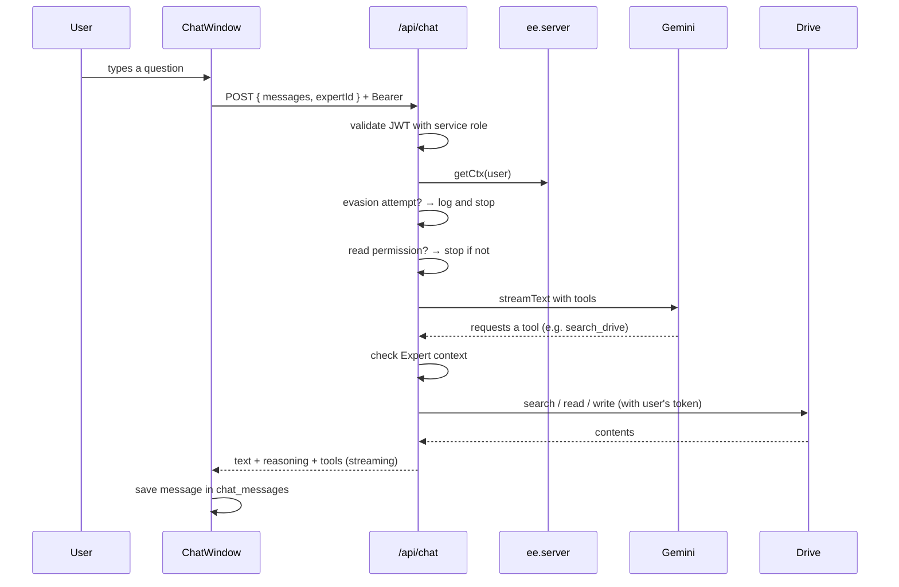

# 02 · Architecture

> **Audience:** engineering team.
> **Executive read:** §1 (stack) and §3 (structure) give the context
> needed to follow a technical discussion. The rest is implementation
> detail.

---

## 1. Stack

| Layer          | Technology                                                           | Version  | Function                                                             |
| -------------- | -------------------------------------------------------------------- | -------- | -------------------------------------------------------------------- |
| Application    | TanStack Start (React 19, file routes, SSR)                          | 1.168    | Server rendering, navigation, server functions                       |
| Build          | Vite                                                                 | 8.1.5    | Dev environment and build. Plugins declared in `vite.config.ts`      |
| Styling        | Tailwind CSS 4 + shadcn/ui                                           | 4.2      | Visual system. Components in `src/components/ui/` derive from shadcn |
| Server         | Nitro                                                                | 3.0 beta | Runtime for server functions                                         |
| Deployment     | Vercel                                                               | —        | Hosting. Nitro preset `vercel` in cloud mode                         |
| Database       | Supabase Postgres                                                    | 15       | Primary store. Row Level Security (RLS) on every table               |
| Migrations     | Drizzle Kit                                                          | 0.31     | Used only as a runner for hand-written `.sql` files                  |
| Authentication | Supabase Auth                                                        | —        | Sessions. Single provider: Google                                    |
| AI             | Vercel AI SDK (`ai`) + `@ai-sdk/google`                              | 7 / 4.0  | Chat orchestration, tools, streaming                                 |
| Model          | Gemini 2.5 Flash (configurable, see [11-opencore](./11-opencore.md)) | —        | Reasoning and answer generation                                      |
| Document store | Google Drive API                                                     | v3       | Per-user read/write                                                  |
| DB client      | `@supabase/supabase-js`                                              | 2.117    | REST client, both browser and server                                 |
| Validation     | Zod                                                                  | 4.6      | Server-side input validation and tool schemas                        |

Two execution modes, selected via `OPENEXPERT_MODE`:

- `cloud` (default): full architecture with Supabase + Vercel, multi-user
  with roles and per-Expert permissions.
- `local`: OpenCore local edition (`packages/opencore/`), single-user
  without authentication, file-based storage. See
  [11-opencore](./11-opencore.md).

## 2. Layers and dependency direction



**Isolation rule:** `.server.ts` modules are never imported from the
browser. The browser Supabase client uses the _publishable key_ only;
the server Supabase client uses the _service role key_, which never
appears in the browser bundle.

## 3. Folder layout

```
src/
├── routes/                       TanStack Router routes (one per file)
│   ├── __root.tsx                App shell, wraps all pages
│   ├── index.tsx                 / → redirect to /expert
│   ├── auth.tsx                  /auth → sign-in screen
│   ├── auth.google.callback.ts   /auth/google/callback → Drive OAuth return
│   ├── api/chat.ts               /api/chat → chat streaming endpoint
│   └── _authenticated/           Routes that require a session
│       ├── route.tsx             Auth guard for the group
│       ├── expert.tsx            /expert → chat (main screen)
│       ├── experts.tsx           /experts → Expert catalogue and creation
│       ├── integrations.tsx      /integrations → tabbed container
│       ├── integrations.index.tsx
│       ├── integrations.sources.tsx     Sources and Drive connection
│       ├── integrations.processes.tsx   Autonomous processes
│       ├── users.tsx             /users → members, roles, invitations
│       └── activity.tsx          /activity → log, reverts
│
├── lib/
│   ├── data.functions.ts       Single write path
│   ├── ee.server.ts            Authorisation, audit, business queries
│   ├── ai/chat.server.ts       Chat: tools, injection guard, streaming
│   ├── drive-tokens.server.ts  Drive OAuth and token lifecycle
│   ├── drive.server.ts         Drive API client (always with userId)
│   ├── opencore/               Local-mode adapters (re-export @openexpert/opencore)
│   ├── store.tsx               UI state and data hooks
│   └── error-*.ts              Error capture and reporting
│
├── integrations/supabase/
│   ├── client.ts               Browser client (publishable key)
│   ├── client.server.ts        Server client (service role) — server-only
│   ├── auth-middleware.ts      Validates JWT on every server function
│   ├── auth-attacher.ts        Injects token into browser requests
│   └── types.ts                Database types
│
└── components/
    ├── AppShell.tsx            Sidebar navigation and header
    └── ui/                     shadcn/ui base components

packages/opencore/           MIT-licensed OpenCore package (published to npm)
drizzle/migrations/         SQL migrations (source of truth for the schema)
docs/                       Documentation (en/, es/)
```

### Build configuration

`vite.config.ts` is the entire build setup and is kept explicit, with no
intermediate layer of abstraction. Plugin order:

1. `tailwindcss()` — compiles `src/styles.css` with Tailwind 4.
2. `tanstackStart()` — routes, SSR, server functions. `importProtection`
   is set to `error`: any `**/server/**` file leaking into the browser
   bundle fails the build instead of failing at runtime. `server.entry`
   points to `src/server.ts`, which wraps TanStack Start's handler to
   turn swallowed errors into a real 500 with a readable page.
3. `nitro()` — only on `build`. The dev server is Vite itself. Nitro
   preset is `vercel` in cloud mode and `node-server` when
   `OPENEXPERT_MODE=local`.
4. `react()` — fast refresh and automatic JSX.

It also defines the `@` → `src` alias, React and TanStack Query
deduplication (`resolve.dedupe`), and pins port 3000 with `strictPort`.

## 4. Mutation flow

Every write follows the same path:



Three properties guaranteed by this design:

1. **Single write path.** No writes from the browser: RLS restricts
   members to read-only, so any INSERT/UPDATE/DELETE attempted
   otherwise is rejected by the database, not just by application code.
2. **Centralised authorisation.** `ee.server.ts` owns the rules
   (`canRead`, `canExec`, `assert`), allowing the full set of restricted
   operations to be audited in a single module.
3. **Full traceability.** After every change, an event is inserted into
   `activity` with the prior rows, which enables revert.

## 5. Chat message flow



## 6. Design decisions

| Decision                                             | Rationale                                                                                                |
| ---------------------------------------------------- | -------------------------------------------------------------------------------------------------------- |
| Writes exclusively via server functions              | Single check for permissions and audit; RLS is a defence in depth                                        |
| Drizzle as runner only                               | Schema is reviewed as SQL; auto-generation produces empty files                                          |
| `vite.config.ts` kept explicit                       | Full visibility of the plugins and their order, no intermediate dependencies                             |
| Single Expert model                                  | The previous model was removed in migration `0010`; `experts` is the live table                          |
| Snapshots in `activity` rather than a separate table | Revert is treated as an activity log case, not a parallel mechanism                                      |
| AI engine does not write directly                    | Actions go through `propose_*`, which generate human approval cards                                      |
| Port 3000 pinned in development                      | OAuth redirect URIs depend on the port; without `strictPort` the server could drift and auth would break |

## 7. Excluded by design

- **No third-party build dependencies.** `vite.config.ts` declares
  plugins for Vite, TanStack Start, Tailwind, React and Nitro directly.
- **Single package manager.** npm with `package-lock.json`. No other
  manager or alternate lockfile is used.
- **No secrets in the repo.** `.env` is git-ignored; `.env.example`
  documents each variable without values.
- **No ORM at runtime.** Data is accessed via REST through PostgREST
  with `supabase-js`.

## 8. References

- [Data model](./03-data-model.md) — tables, policies and triggers.
- [Security & access](./04-security.md) — authorisation rules.
- [AI](./05-ai.md) — assistant tools.
- [Development](./07-development.md) — local environment and migrations.
- [OpenCore](./11-opencore.md) — local mode and the published package.
