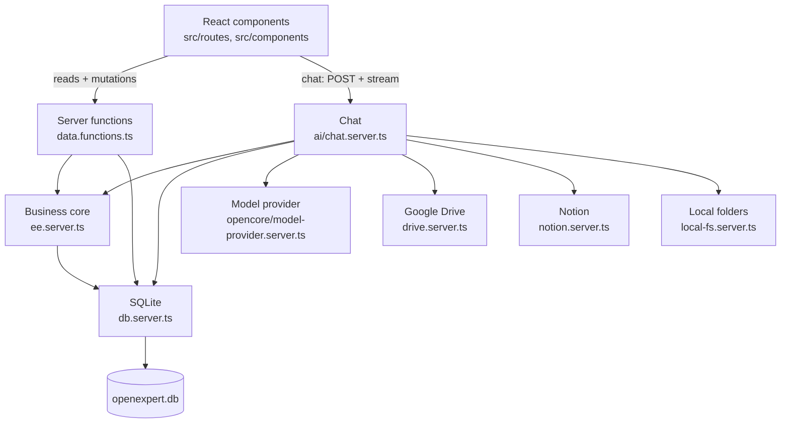
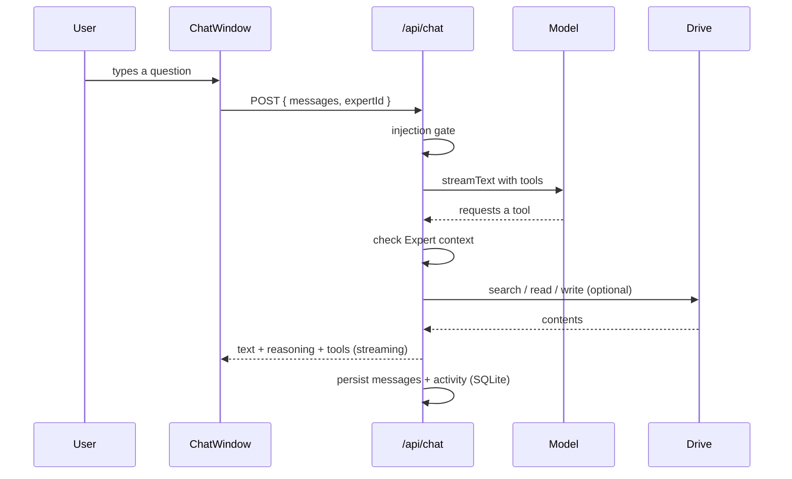

# 02 · Architecture

> **Audience:** engineering team.

OpenExpert is a **local-first** application: everything runs on your machine.
There is no cloud, no database server and no login.

---

## 1. Stack

| Layer       | Technology                                                  | Function                                           |
| ----------- | ----------------------------------------------------------- | -------------------------------------------------- |
| Application | TanStack Start (React 19, file routes, SSR)                 | Rendering, navigation, server functions            |
| Build       | Vite                                                        | Dev environment and build                          |
| Styling     | Tailwind CSS 4 + shadcn/ui                                  | Visual system                                      |
| Server      | Nitro (`node-server`)                                       | Runtime for the built server                       |
| Database    | SQLite via `sql.js`                                         | Single file at `OPENEXPERT_DATA_DIR/openexpert.db` |
| ORM         | Drizzle ORM (`sql-js`)                                      | Typed queries; schema in `drizzle/schema.ts`       |
| AI          | Vercel AI SDK (`ai`) + `@ai-sdk/google` / `@ai-sdk/openai`  | Chat, tools, streaming                             |
| Model       | Ollama (default), Gemini, or any OpenAI-compatible endpoint | Reasoning and answers                              |
| Sources     | Google Drive API, local folders, Notion (optional)          | Read/write the owner's content                     |

## 2. Layers and dependency direction



**Rules:** `.server.ts` modules never reach the browser. All reads and writes go
through server functions; there is no direct browser access to the database.

## 3. Folder layout

```
src/
├── routes/                     TanStack Router routes
│   ├── __root.tsx              App shell
│   ├── index.tsx               / → redirect to /expert
│   ├── auth.google.callback.ts Drive OAuth return
│   ├── auth.notion.callback.ts Notion OAuth return
│   ├── api/chat.ts             Chat streaming endpoint
│   └── _authenticated/         Layout group (no auth guard)
├── lib/
│   ├── db.server.ts            SQLite open + schema init + seed
│   ├── data.functions.ts       Server functions (single write path)
│   ├── ee.server.ts            Audit, revert, business queries
│   ├── ai/chat.server.ts       Chat: tools, injection guard, streaming
│   ├── drive.server.ts         Google Drive API client
│   ├── drive-tokens.server.ts  Drive OAuth and token lifecycle
│   ├── local-fs.server.ts      Granted local folders (read + approved writes)
│   ├── notion.server.ts        Notion API client
│   ├── notion-tokens.server.ts Notion OAuth and token lifecycle
│   ├── office.server.ts        Text/PDF/Office extraction (Drive + local)
│   └── opencore/               Model provider + local credentials
├── components/                 AppShell and shadcn/ui
drizzle/
├── schema.ts                   Typed SQLite schema (Drizzle)
├── migrations/                 Incremental DDL (PRAGMA user_version)
└── init.sql                    DDL applied at startup
packages/opencore/              MIT engine + CLI
```

## 4. Mutation flow

1. A React component calls a server function in `data.functions.ts`.
2. The handler writes to SQLite through `db.server.ts` and calls `persist()`.
3. It logs an `activity` row (with a snapshot of the prior rows) via `ee.server.ts`.
4. The client invalidates the workspace query and reloads.

There is no RLS: the app is single-owner, so authorization is trivial and lives
in code. Reversion replays the snapshot from the activity log.

## 5. Chat message flow



## 6. Design decisions

| Decision                                 | Rationale                                                          |
| ---------------------------------------- | ------------------------------------------------------------------ |
| SQLite via `sql.js`                      | No native build, works on any Node; single-file, portable database |
| Hand-written `init.sql` + Drizzle schema | Simple, transparent schema; no migration tooling needed at runtime |
| Writes only via server functions         | Single place for persistence and audit                             |
| AI engine does not write directly        | Actions go through `propose_*` and require approval                |
| Port 3000 pinned                         | The Google Drive OAuth redirect URI depends on it                  |

## 7. References

- [Data model](./03-data-model.md) — SQLite tables.
- [Security & access](./04-security.md) — single owner and secrets.
- [AI](./05-ai.md) — tools.
- [Development](./07-development.md) — environment.
