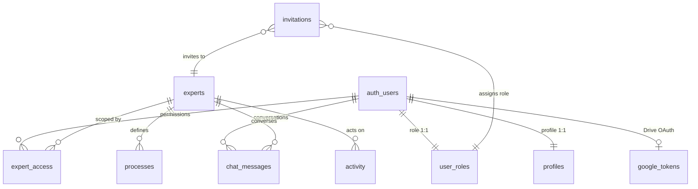

# 03 · Data model

> **Audience:** engineering team. §2 and §3 describe the business model
> without needing to read code.

---

## 1. Summary

A single PostgreSQL database, organised in four functional blocks:

| Block     | Tables                                                   | Identity                                   |
| --------- | -------------------------------------------------------- | ------------------------------------------ |
| Identity  | `profiles`, `user_roles`, `invitations`, `expert_access` | Person, role, per-Expert visibility        |
| Content   | `experts`, `processes`, `integrations`, `chat_messages`  | Experts, processes, sources, conversations |
| Operation | `deals`, `invoices`, `campaigns`, `accounts`, `activity` | Business data and activity log             |
| Security  | `google_tokens`                                          | Per-user OAuth credentials                 |

> Local mode note: when `OPENEXPERT_MODE=local` (OpenCore,
> `packages/opencore/`), persistence is a set of files on disk instead
> of PostgreSQL. This document describes the cloud schema.

## 2. Relationship diagram

## 3. Tables

### 3.1. Identity and access

#### `profiles` — person identity

| Column       | Type          | Notes                                                                       |
| ------------ | ------------- | --------------------------------------------------------------------------- |
| `id`         | `uuid`        | Primary key. Matches `id` in `auth.users`                                   |
| `name`       | `text`        | Display name. Derived from Google profile if the invitation did not set one |
| `email`      | `text`        | Google account email                                                        |
| `title`      | `text`        | Title or label. Default: "Member"                                           |
| `created_at` | `timestamptz` | Sign-up time                                                                |

The table is populated exclusively by the `handle_new_user` trigger.
The absence of a row implies denial of access to the application.

#### `user_roles` — overall role

| Column    | Type       | Value                           |
| --------- | ---------- | ------------------------------- |
| `user_id` | `uuid`     | Reference to `profiles`         |
| `role`    | `app_role` | `ADMIN`, `INTERMEDIO`, `LECTOR` |

One row per person. The role is the maximum permission level; per-Expert
permissions are defined in `expert_access`.

#### `expert_access` — per-Expert permission

| Column      | Type   | Value                  |
| ----------- | ------ | ---------------------- |
| `user_id`   | `uuid` | Person                 |
| `expert_id` | `text` | Expert                 |
| `access`    | `text` | `none`, `read`, `exec` |

One row per person-Expert. Determines visibility and execution rights.

#### `invitations` — pending invitations

| Column       | Type          | Notes                               |
| ------------ | ------------- | ----------------------------------- |
| `email`      | `text`        | Unique. Normalised to lowercase     |
| `name`       | `text`        | Display name within the application |
| `title`      | `text`        | Title                               |
| `role`       | `app_role`    | Role granted on acceptance          |
| `expert_id`  | `text`        | Expert granted access               |
| `created_at` | `timestamptz` | Issue time                          |

Invitations are **single-use**: the trigger removes them on first sign-in.

#### `google_tokens` — Drive credentials

| Column          | Type          | Notes                                      |
| --------------- | ------------- | ------------------------------------------ |
| `user_id`       | `uuid`        | Primary key. One row per person            |
| `access_token`  | `text`        | Short-lived token, refreshed automatically |
| `refresh_token` | `text`        | Long-lived token. The effective credential |
| `expires_at`    | `timestamptz` | Expiration of the access token             |
| `scopes`        | `text`        | Permissions granted by the user            |
| `updated_at`    | `timestamptz` | Last update                                |

RLS active, no user policies: the table is invisible even to its
owner. Only the service role can read or write it. The content is never
exposed to the browser. In local mode, credentials are stored in
`credentials.json` (mode `0600`) inside the local data directory.

### 3.2. Content

#### `experts` — Experts

| Column        | Type          | Notes                                                                 |
| ------------- | ------------- | --------------------------------------------------------------------- |
| `id`          | `text`        | Primary key. Human-readable identifier (`general`, `ventas`, …)       |
| `name`        | `text`        | Display name                                                          |
| `description` | `text`        | Injected in the system prompt: defines the assistant's identity       |
| `sources`     | `text[]`      | Authorised connectors. An Expert without `gdrive` cannot access Drive |
| `created_at`  | `timestamptz` | —                                                                     |

#### `processes` — autonomous processes

| Column        | Type          | Notes                                                                |
| ------------- | ------------- | -------------------------------------------------------------------- |
| `id`          | `text`        | `p-` prefix + short name                                             |
| `name`        | `text`        | —                                                                    |
| `description` | `text`        | —                                                                    |
| `trigger`     | `text`        | Trigger condition, descriptive (e.g. "Cron · Friday 17:00")          |
| `stages`      | `text[]`      | Stages shown when requesting a run                                   |
| `limits`      | `text[]`      | Declared limits                                                      |
| `approval`    | `text`        | `Ninguna`/`None`, `Requerida`/`Required`, `Doble firma`/`Dual sign.` |
| `expert_id`   | `text`        | Owning Expert                                                        |
| `active`      | `boolean`     | An inactive process cannot run                                       |
| `runs`        | `integer`     | Run counter                                                          |
| `last_run`    | `timestamptz` | —                                                                    |

> `trigger` is descriptive text, not an effective scheduler. Processes
> run on demand or from an approval card.

#### `integrations` — connector catalogue

| Column      | Type          | Notes                                         |
| ----------- | ------------- | --------------------------------------------- |
| `id`        | `text`        | `gdrive`, `pipedrive`, `holded`, …            |
| `name`      | `text`        | Display name                                  |
| `category`  | `text`        | CRM, ERP / Finance, Advertising, Productivity |
| `connected` | `boolean`     | Status. Only `gdrive` may be `true` today     |
| `entities`  | `jsonb`       | Count of elements from the last sync          |
| `last_sync` | `timestamptz` | —                                             |

#### `chat_messages` — conversations

| Column            | Type          | Notes                                              |
| ----------------- | ------------- | -------------------------------------------------- |
| `id`              | `uuid`        | Auto-generated                                     |
| `user_id`         | `uuid`        | Author. Each user accesses only their own messages |
| `expert_id`       | `text`        | Expert of the conversation                         |
| `conversation_id` | `text`        | Grouping within a thread. Default: `default`       |
| `message`         | `jsonb`       | Full message with text and tool parts              |
| `created_at`      | `timestamptz` | —                                                  |

**Retention: 30 days.** `listConversations` prunes threads older than
30 days when opening the history of an Expert.

### 3.3. Operation

#### `activity` — activity log

Central table for control and audit.

| Column        | Type          | Notes                                                                          |
| ------------- | ------------- | ------------------------------------------------------------------------------ |
| `id`          | `text`        | `evt_` prefix + 8 random chars                                                 |
| `ts`          | `timestamptz` | Current time by default                                                        |
| `actor`       | `text`        | `human` or `agent`                                                             |
| `actor_name`  | `text`        | Person's name or assistant identifier                                          |
| `type`        | `text`        | `Configuration`, `Query`, `Integration`, `Security`, …                         |
| `expert_id`   | `text`        | Affected Expert. Default: `general`                                            |
| `status`      | `text`        | `ok`, `pending`, `denied`, `failed`, `reverted`                                |
| `summary`     | `text`        | One-sentence description                                                       |
| `sources`     | `text[]`      | Information sources                                                            |
| `duration_ms` | `integer`     | Duration                                                                       |
| `snapshot`    | `jsonb`       | Two variants: `entries` (prior rows, for revert) or `pending` (pending action) |

#### Business tables

Populated by the corresponding external sources.

| Table       | Entity                | Relevant fields                                                               |
| ----------- | --------------------- | ----------------------------------------------------------------------------- |
| `deals`     | CRM opportunities     | `company`, `stage`, `value`, `owner`, `days_in_stage`, `close_date`, `status` |
| `invoices`  | ERP invoices          | `client`, `amount`, `due_date`, `status`, `reminders`                         |
| `campaigns` | Advertising campaigns | `channel`, `spend_7d`, `conversions_7d`, `cpa_target`, `daily_budget`         |
| `accounts`  | Customer accounts     | `mrr`, `usage_trend`, `open_tickets`, `churn_risk`                            |

These tables are not edited from the UI, except `reminders` (counter
for collection reminders) which is updated when an assistant action is
approved.

## 4. Removed tables (previous model)

The Expert concept had two successive representations in the schema.
Between migrations `0004` and `0010` both versions coexisted with sync
triggers. Migration `0010` completely removed the previous version:
tables, columns, triggers, sync functions, indexes. `expert_id` is
currently `NOT NULL` with default `general`.

## 5. Database-level security

Every table has RLS active. Policies are read-only, with three
exceptions:

| Table           | Policy                | Operation | Condition                |
| --------------- | --------------------- | --------- | ------------------------ |
| Business tables | `members read`        | `SELECT`  | Any authenticated member |
| `chat_messages` | `own messages read`   | `SELECT`  | `user_id = auth.uid()`   |
| `chat_messages` | `own messages insert` | `INSERT`  | `user_id = auth.uid()`   |
| `chat_messages` | `own messages delete` | `DELETE`  | `user_id = auth.uid()`   |
| `profiles`      | `own profile update`  | `UPDATE`  | `id = auth.uid()`        |
| `google_tokens` | **none**              | —         | Service role only        |

This design is intentional: per-Expert segmentation is enforced in the
application layer (`ee.server.ts`). See
[04-security §7](./04-security.md#7-known-limits-of-the-model).

## 6. Functions

| Function                       | Type              | Function                                                                      |
| ------------------------------ | ----------------- | ----------------------------------------------------------------------------- |
| `handle_new_user`              | trigger           | Access gate: validates provider and email, creates profile, role, permissions |
| `has_role(uuid, app_role)`     | function          | Checks whether a user holds a given role                                      |
| `normalise_auth_user_tokens()` | trigger           | Normalises `auth.users` token columns to empty string                         |
| `rls_auto_enable()`            | migration utility | Migration helper that turns RLS on                                            |

### `auth.users` note

The auth service interprets five columns of `auth.users` as non-null
strings. If any is `NULL`, the admin API returns 500. The
`normalise_auth_user_tokens()` trigger normalises these columns to the
empty string and must not be omitted.

## 7. Migrations

Eleven SQL files in `drizzle/migrations/`, applied and verified:

| #    | File                                 | Content                                                    |
| ---- | ------------------------------------ | ---------------------------------------------------------- |
| 0000 | `expertengine_core.sql`              | Full schema, RLS, base policies and functions              |
| 0001 | `reset_demo_fn.sql`                  | Demo data loader function (removed in 0009)                |
| 0002 | `restrict_signup_single_email.sql`   | Restricted access to invitations                           |
| 0003 | `chat_conversations.sql`             | Conversation threads in chat                               |
| 0004 | `add_experts_compatibility.sql`      | `experts` and `expert_access` alongside the previous model |
| 0005 | `expert_context_insert_defaults.sql` | Defaults for `expert_id` on insert                         |
| 0006 | `allow_invited_users.sql`            | Trigger accepts invitations plus the initial owner         |
| 0007 | `google_drive_tokens.sql`            | `google_tokens` table without user policies                |
| 0008 | `normalise_auth_user_tokens.sql`     | `auth.users` token normalisation trigger                   |
| 0009 | `drop_reset_demo.sql`                | Removes unused `reset_demo()`                              |
| 0010 | `drop_legacy_mirrors.sql`            | Removes the previous model                                 |

The procedure for adding a migration is described in
[07-development §5](./07-development.md#5-migrations).
