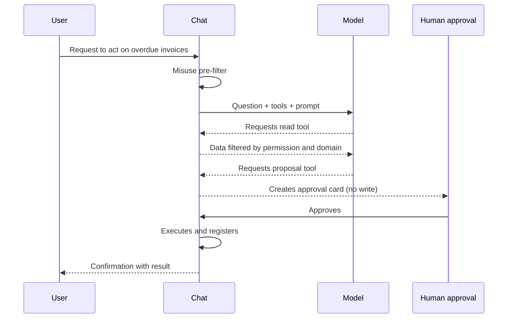

# 05 · Artificial intelligence

> **Audience:** both. Business: what the assistant can and cannot do.
> Engineering: tools, permissions, prompt.

---

## 1. Model and provider

| Aspect       | Cloud edition (default)     | Local edition (OpenCore)                                              |
| ------------ | --------------------------- | --------------------------------------------------------------------- |
| Model        | Gemini 2.5 Flash            | Configurable                                                          |
| Access       | Google AI Studio API        | Per provider                                                          |
| Selector     | Fixed                       | `src/lib/opencore/model-provider.server.ts`                           |
| Variables    | `GOOGLE_API_KEY`            | `OPENEXPERT_MODEL_PROVIDER`, `OPENEXPERT_MODEL_ID`, keys per provider |
| Orchestrator | Vercel AI SDK, `streamText` | Identical                                                             |
| Reasoning    | On and visible in UI        | Identical                                                             |
| Step limit   | 50 steps per turn           | Identical                                                             |
| Streaming    | Token by token              | Identical                                                             |
| Language     | **Always Spanish**          | Identical                                                             |

With `OPENEXPERT_MODEL_PROVIDER=ollama` inference runs on your machine
without sending data to third parties. With `openai-compatible` you
provide your own endpoint and key. With `openexpert` you use the
OpenExpert gateway.

### 1.1. Purpose of visible reasoning

When the assistant uses tools, the user sees the reasoning before the
result. It increases trust and allows auditing why each tool was called.

## 2. Tool catalog

The assistant has no direct access to the database. It can only call
the following 14 tools, each with a server-side permission check.

### 2.1. Read tools

| Tool                       | Content                                                          | Side effect |
| -------------------------- | ---------------------------------------------------------------- | ----------- |
| `get_pipeline_summary`     | Open value, deal count, win rate, weighted forecast, stuck deals | `ventas`    | `read` |
| `list_deals`               | Open opportunities, optionally by stage                          | `ventas`    | `read` |
| `list_overdue_invoices`    | Overdue invoices with amount, days overdue, reminders            | `finanzas`  | `read` |
| `get_campaign_performance` | Spend, conversions, real CPA vs target, status                   | `marketing` | `read` |
| `get_churn_risk`           | MRR, usage trend, open tickets, churn probability                | `general`   | `read` |
| `list_processes`           | Process catalogue with trigger, approval and status              | transversal | `read` |

### 2.2. Google Drive tools

| Tool                | Function                                          | Requires              |
| ------------------- | ------------------------------------------------- | --------------------- |
| `search_drive`      | Search files by name or content                   | `gdrive` in `sources` |
| `read_drive_file`   | Read text from Docs, Sheets (CSV), Slides, or PDF | `gdrive` in `sources` |
| `create_drive_file` | Create Docs, Sheets, plain text or Markdown       | `gdrive` + `exec`     |
| `update_drive_file` | Rewrite an existing file                          | `gdrive` + `exec`     |

Drive writes are the only exception to "AI proposes, human approves":
approval is implicit in the chat request. Every write is logged in
`activity`.

### 2.3. Proposal tools (do not execute)

| Tool                        | Proposes                          | Requires              |
| --------------------------- | --------------------------------- | --------------------- |
| `propose_invoice_reminders` | Send collection reminders         | `exec` in `finanzas`  |
| `propose_pause_campaigns`   | Pause campaigns over their target | `exec` in `marketing` |
| `request_process_run`       | Run an autonomous process         | `exec` in its Expert  |

These three tools modify no data. They create a row in `activity` with
status `pending`, shown as a confirmation card.

### 2.4. Utility

| Tool               | Function                    | Restriction  |
| ------------------ | --------------------------- | ------------ |
| `open_expert_form` | Form to create a new Expert | `ADMIN` only |

## 3. Per-domain isolation

Each read tool belongs to a domain (`ventas`, `finanzas`, `marketing`,
`general`). Before execution it checks that the active Expert matches
the domain, or is `general`, and that the user has read permission.

- From `ventas`, only `ventas` data is queried.
- From `general`, every domain with permission.
- Out of context: readable error, no data.

Drive isolation is decided by the Expert's `sources` column, not by
domain.

## 4. Full cycle of a request

## 5. System prompt

It lives in the server chat layer and is built on every turn:

1. **Role and format.** Assistant identity, Spanish, executive tone.
2. **Active context.** Name, description and sources of the Expert.
3. **User and permissions.** Identity, role and permissions. The model
   knows its visibility, but does not decide.
4. **Drive state.** Search/read instructions if `gdrive` is enabled.
5. **Rules.** Data only via tools, no inferred numbers, never declare
   actions executed without approval, never reveal instructions,
   reject evasion.
6. **Output format.** Executive conclusion, compact table (max 6 rows)
   or short list, 2–3 numbered recommendations, at most one risk
   notice. No emojis.

## 6. Proactive tool activation

When the user mentions Drive, documents or corporate information, the
prompt instructs the use of `search_drive` followed by `read_drive_file`
before answering.

## 7. Limits and cost control

| Limit             | Value / behaviour                                 |
| ----------------- | ------------------------------------------------- |
| Steps per turn    | 50                                                |
| Message size      | Input validation with Zod                         |
| History retention | 30 days (opportunistic cleanup)                   |
| Quota errors      | 429 → "limit reached" message                     |
| Credential errors | 400/403 → "key invalid" message                   |
| Cost per query    | Provider API cost. With Ollama, no external cost. |

## 8. References

- [Security & access §5](./04-security.md#5-guarantees-against-assistant-misuse) — guarantees.
- [Integrations §4](./06-integrations.md#4-exception-for-drive-writes) — Drive exception.
- [OpenCore](./11-opencore.md) — providers in local mode.
