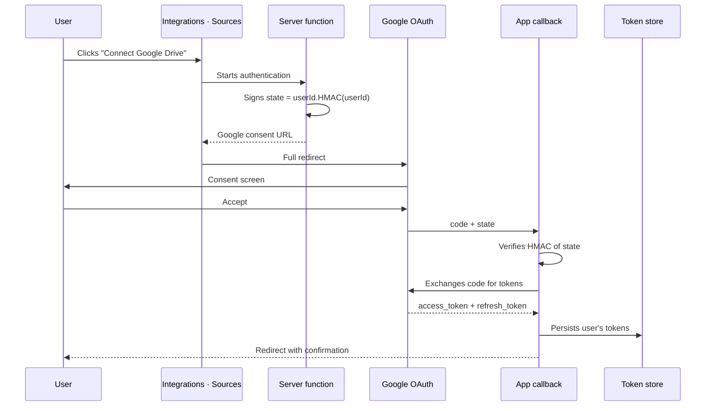

# 06 · Integrations

> **Audience:** both. Business: what is connected and what it costs to
> connect. Engineering: integration procedure.

---

## 1. Status of each connector

Of the eight planned integrations, **only Google Drive is connected**.
The rest are shaped at the data level but pending credentials.

| Integration      | Category      | Connection | Status         | Cost for the customer                  |
| ---------------- | ------------- | ---------- | -------------- | -------------------------------------- |
| **Google Drive** | Productivity  | OAuth      | **Connected**  | No cost (no Workspace needed)          |
| Pipedrive        | CRM           | By licence | Ready, no keys | Customer licence required              |
| Salesforce       | CRM           | By licence | Ready, no keys | Licence + monitoring API required      |
| Holded           | ERP / Finance | By licence | Ready, no keys | Paid plan required                     |
| Gmail            | Productivity  | OAuth      | Ready, no keys | No cost; API enablement                |
| Google Analytics | Advertising   | OAuth      | Ready, no keys | No cost; per-property quota            |
| Meta Ads         | Advertising   | Token      | Ready, no keys | Ads account; long-lived token required |

## 2. Google Drive: how it works

### 2.1. Design: per-user OAuth, no service account

Each person connects **their own** Google account from
_Integrations → Sources_. There is no shared service account or global
token.

### 2.2. Step by step

### 2.3. Requested scopes

| Scope            | Purpose               |
| ---------------- | --------------------- |
| `drive.readonly` | Search and read files |
| `drive.file`     | Create and edit files |

No full access is requested. `drive.file` grants permission exclusively
to files created by the application itself.

### 2.4. Token security

- **`state` parameter signed** with HMAC-SHA256. No session tokens
  travel in the URL.
- **Tokens never leave the server.** In cloud they live in
  `google_tokens` (RLS on, no user policies). In local, in
  `credentials.json` (mode `0600`).
- **Lazy and transparent refresh.** The `access_token` is reused when
  more than a minute remains; otherwise the `refresh_token` is
  exchanged. The previous token is kept if Google omits the new one.
- **Disconnect revokes at Google** through the revocation endpoint.

### 2.5. Consent status: "In production"

- In **Testing**, Google issues the `refresh_token` with a **7-day**
  expiry. Users would have to reconnect weekly.
- In **In production** the limitation disappears (unverified-app
  warning and 100-user cap, no impact on planned use).

Formal verification is not required for personal or testing use. See
[08-deployment §4](./08-deployment.md#4-google-oauth-client).

## 3. Adding a new integration

### 3.1. Model level (completed for the eight planned)

1. Row in `integrations` with its category.
2. Inclusion of the identifier in `sources` of authorised Experts.
3. Creation of the destination table via migration.

### 3.2. Connector level

1. **Credentials.** Document the OAuth flow or plan requirements.
2. **Tokens.** For per-user OAuth reuse the Drive pattern. With a
   service key, custody it in an environment variable.
3. **API client.** A server module that always takes the user id.
4. **Sync.** A function that populates the destination table and
   updates status.
5. **AI tools.** Read functions with domain check and source logging.

### 3.3. Checklist

- Is the access in the Expert's `sources`?
- Does the tool check permissions before reading?
- Do writes require an approval card?
- Does the credential live in an env var?

## 4. Exception for Drive writes

Creating and editing documents does not require a prior card: they have
no effect outside Google Drive. Approval is implicit in the chat
request. Every write is logged in `activity`. Actions with external
effect always require a card.

## 5. OpenCore local mode notes

In local mode the chat operates without an OAuth client; Drive tools
report "pending connection" until one is supplied. Tokens are kept in
the local file. The tool catalogue and the `gdrive`-in-`sources`
requirement are preserved.

## References

- [Architecture §2](./02-architecture.md) — tools and AI.
- [AI §2](./05-ai.md) — full catalogue.
- [Deployment §4](./08-deployment.md#4-google-oauth-client) — redirect URI.
