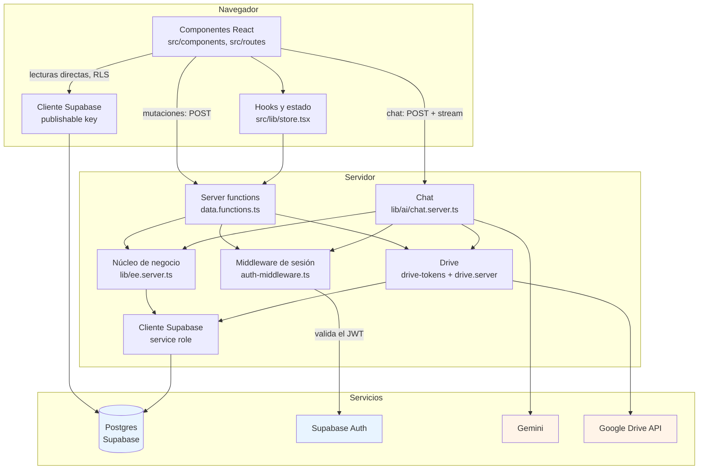
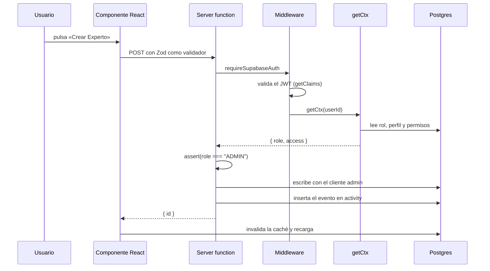
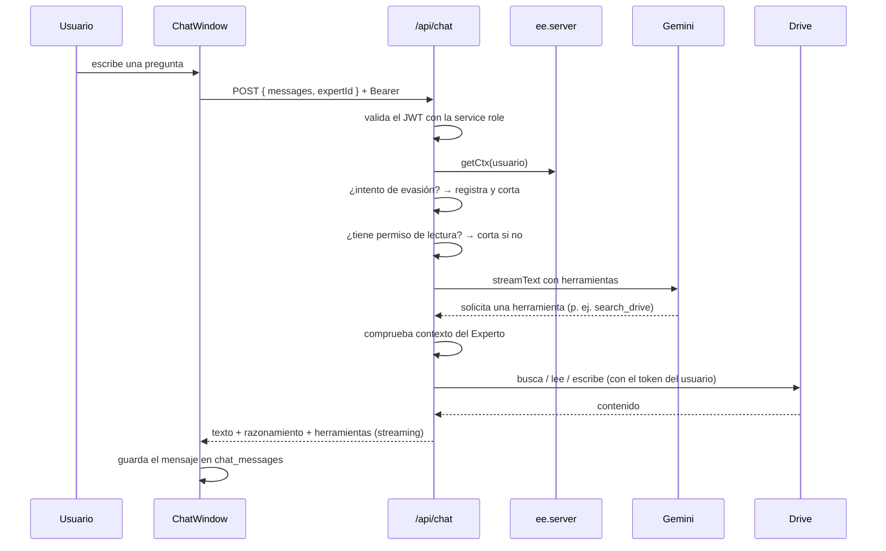

# 02 · Arquitectura

> **Audiencia:** equipo de ingeniería.
> **Lectura ejecutiva:** las secciones 1 (stack tecnológico) y 3 (estructura del proyecto) proporcionan el contexto suficiente para el seguimiento de una conversación técnica. Las secciones restantes describen detalle de implementación.

---

## 1. Stack tecnológico

| Capa                      | Tecnología                                                           | Versión  | Función                                                                          |
| ------------------------- | -------------------------------------------------------------------- | -------- | -------------------------------------------------------------------------------- |
| Aplicación                | TanStack Start (React 19, rutas por archivo, SSR)                    | 1.168    | Renderizado en servidor, navegación y funciones de servidor                      |
| Empaquetado               | Vite                                                                 | 8.1.5    | Entorno de desarrollo y build. Plugins declarados en `vite.config.ts`            |
| Estilos                   | Tailwind CSS 4 + shadcn/ui                                           | 4.2      | Sistema visual. Los componentes de `src/components/ui/` derivan de shadcn        |
| Servidor                  | Nitro                                                                | 3.0 beta | Runtime de las funciones de servidor                                             |
| Despliegue                | Vercel                                                               | —        | Alojamiento. Preset `vercel` en `vite.config.ts` en modo cloud                   |
| Base de datos             | Supabase Postgres                                                    | 15       | Almacenamiento principal. Row Level Security (RLS) activo en todas las tablas    |
| Migraciones               | Drizzle Kit                                                          | 0.31     | Utilizado exclusivamente como ejecutor de ficheros `.sql` redactados manualmente |
| Autenticación             | Supabase Auth                                                        | —        | Gestión de sesiones. Proveedor único: Google                                     |
| IA                        | Vercel AI SDK (`ai`) + `@ai-sdk/google`                              | 7 / 4.0  | Orquestación del chat, herramientas y streaming                                  |
| Modelo                    | Gemini 2.5 Flash (configurable, ver [11-opencore](./11-opencore.md)) | —        | Razonamiento y generación de respuestas                                          |
| Almacenamiento documental | API de Google Drive                                                  | v3       | Lectura y escritura de documentos por usuario                                    |
| Cliente de base de datos  | `@supabase/supabase-js`                                              | 2.117    | Cliente REST, tanto en navegador como en servidor                                |
| Validación                | Zod                                                                  | 4.6      | Validación de entradas en servidor y esquemas de herramientas                    |

Modos de ejecución: la aplicación opera en dos modos, seleccionados mediante la variable `OPENEXPERT_MODE`:

- `cloud` (valor por defecto): arquitectura completa con Supabase y Vercel, multiusuario con roles y permisos por Experto.
- `local`: núcleo descargable OpenCore (`packages/opencore/`), monousuario sin autenticación, almacenamiento en ficheros locales. Ver [11-opencore](./11-opencore.md).

## 2. Capas y sentido de la dependencia



**Regla de aislamiento:** los módulos `.server.ts` no se importan nunca desde el navegador. El cliente Supabase de navegador utiliza exclusivamente la _publishable key_; únicamente el cliente de servidor utiliza la _service role key_, la cual nunca se expone al bundle del cliente.

## 3. Estructura de carpetas

```
src/
├── routes/                       Rutas de TanStack Router (una por fichero)
│   ├── __root.tsx                Armazón de la aplicación, envuelve todas las páginas
│   ├── index.tsx                 / → redirige a /expert
│   ├── auth.tsx                  /auth → pantalla de acceso
│   ├── auth.google.callback.ts   /auth/google/callback → retorno del OAuth de Drive
│   ├── api/chat.ts               /api/chat → endpoint de streaming del chat
│   └── _authenticated/           Rutas que requieren sesión iniciada
│       ├── route.tsx             Guardia de autenticación del grupo
│       ├── expert.tsx            /expert → chat (pantalla principal)
│       ├── experts.tsx           /experts → catálogo y alta de Expertos
│       ├── integrations.tsx      /integrations → contenedor con pestañas
│       ├── integrations.index.tsx
│       ├── integrations.sources.tsx     Fuentes de datos y conexión de Drive
│       ├── integrations.processes.tsx   Procesos autónomos
│       ├── users.tsx             /users → miembros, roles e invitaciones
│       └── activity.tsx          /activity → registro, aprobaciones y reversión
│
├── lib/
│   ├── data.functions.ts       Única puerta de escritura
│   ├── ee.server.ts            Autorización, auditoría y consultas de negocio
│   ├── ai/chat.server.ts       Chat: herramientas, control anti-inyección, streaming
│   ├── drive-tokens.server.ts  OAuth de Drive y ciclo de vida de los tokens
│   ├── drive.server.ts         Cliente de la API de Drive (siempre con userId)
│   ├── opencore/               Adaptadores del modo local (MIT)
│   ├── store.tsx               Estado de interfaz y hooks de datos
│   └── error-*.ts              Captura y reporte de errores
│
├── integrations/supabase/
│   ├── client.ts               Cliente de navegador (publishable key)
│   ├── client.server.ts        Cliente de servidor (service role) — solo en .server
│   ├── auth-middleware.ts      Valida el JWT de sesión en cada server function
│   ├── auth-attacher.ts        Inyecta el token en las peticiones del navegador
│   └── types.ts                Tipos de la base de datos
│
└── components/
    ├── AppShell.tsx            Navegación lateral y cabecera
    └── ui/                     Componentes base de shadcn/ui

drizzle/migrations/          Migraciones SQL (fuente de verdad del esquema)
packages/opencore/           Núcleo local MIT (modo OPENEXPERT_MODE=local)
docs/                        Documentación del proyecto
```

### Configuración de build

`vite.config.ts` constituye la configuración completa y se mantiene de forma explícita, sin capas intermedias de abstracción. El orden de los plugins es el siguiente:

1. `tailwindcss()` — compila `src/styles.css` con Tailwind 4.
2. `tanstackStart()` — rutas, SSR y funciones de servidor. Con `importProtection` en modo `error`, cualquier fichero bajo `**/server/**` incluido en el bundle del navegador interrumpe el build en lugar de fallar en runtime. `server.entry` apunta a `src/server.ts`, que envuelve el handler de TanStack Start para convertir errores no propagados en un error 500 con página legible.
3. `nitro()` — únicamente en `build`. En desarrollo sirve el propio servidor de Vite. El preset es `vercel` en modo cloud y `node-server` cuando `OPENEXPERT_MODE=local`.
4. `react()` — refresco rápido y JSX automático.

Adicionalmente define el alias `@` → `src`, la deduplicación de React y TanStack Query (`resolve.dedupe`), y fija el puerto 3000 con `strictPort`.

## 4. Flujo de una mutación

Toda escritura sigue invariablemente el mismo recorrido:



Propiedades fundamentales de este diseño:

1. **Puerta única de escritura.** No existen escrituras desde el navegador: RLS restringe a los miembros a solo lectura, de modo que cualquier operación `INSERT`/`UPDATE`/`DELETE` por vías alternativas es rechazada por la base de datos, no únicamente por el código de aplicación.
2. **Autorización centralizada.** `ee.server.ts` concentra las reglas (`canRead`, `canExec`, `assert`), lo que permite auditar el conjunto completo de operaciones restringidas en un único módulo.
3. **Trazabilidad completa.** Tras cada cambio se inserta un evento en `activity` con las filas previas, lo que permite su reversión.

## 5. Flujo de un mensaje de chat



## 6. Decisiones de diseño

| Decisión                                         | Fundamento                                                                                                                                                                   |
| ------------------------------------------------ | ---------------------------------------------------------------------------------------------------------------------------------------------------------------------------- |
| Escrituras exclusivamente vía server functions   | Punto único de comprobación de permisos y registro de auditoría; RLS actúa como garantía adicional                                                                           |
| Drizzle exclusivamente como ejecutor             | El esquema se controla mediante SQL revisable; la generación automática produciría ficheros vacíos                                                                           |
| `vite.config.ts` mantenido explícitamente        | Visibilidad completa de los plugins ejecutados y su orden, sin dependencias intermedias                                                                                      |
| Modelo único de Expertos                         | El modelo anterior fue retirado en la migración `0010`; `experts` es la tabla vigente. Ver [03-modelo-de-datos](./03-modelo-de-datos.md#4-tablas-eliminadas-modelo-anterior) |
| Snapshots en `activity` en lugar de tabla aparte | La reversión se trata como un caso del registro de actividad, sin duplicar mecanismos                                                                                        |
| El motor de IA no escribe directamente           | Las acciones se canalizan vía `propose_*`, que generan tarjetas de aprobación humana                                                                                         |
| Puerto 3000 fijo en desarrollo                   | Las URI de redirección OAuth dependen del puerto; sin `strictPort` el servidor podría desplazarse y la autenticación fallaría                                                |

## 7. Elementos excluidos por diseño

- **Sin dependencias de terceros en el build.** `vite.config.ts` declara directamente los plugins de Vite, TanStack Start, Tailwind, React y Nitro.
- **Gestor de paquetes único.** npm con `package-lock.json`. No se utiliza ningún otro gestor ni fichero de bloqueo alternativo.
- **Sin secretos en el repositorio.** `.env` está excluido del control de versiones; `.env.example` documenta cada variable sin valores.
- **Sin ORM en tiempo de ejecución.** El acceso a datos se realiza vía REST contra PostgREST mediante `supabase-js`.

## 8. Referencias

- [Modelo de datos](./03-modelo-de-datos.md) — tablas, políticas y triggers.
- [Seguridad y acceso](./04-seguridad-y-acceso.md) — reglas de autorización.
- [Inteligencia artificial](./05-inteligencia-artificial.md) — herramientas del asistente.
- [Desarrollo](./07-desarrollo.md) — entorno local y migraciones.
- [OpenCore](./11-opencore.md) — modo local (`OPENEXPERT_MODE=local`) y `packages/opencore/`.
