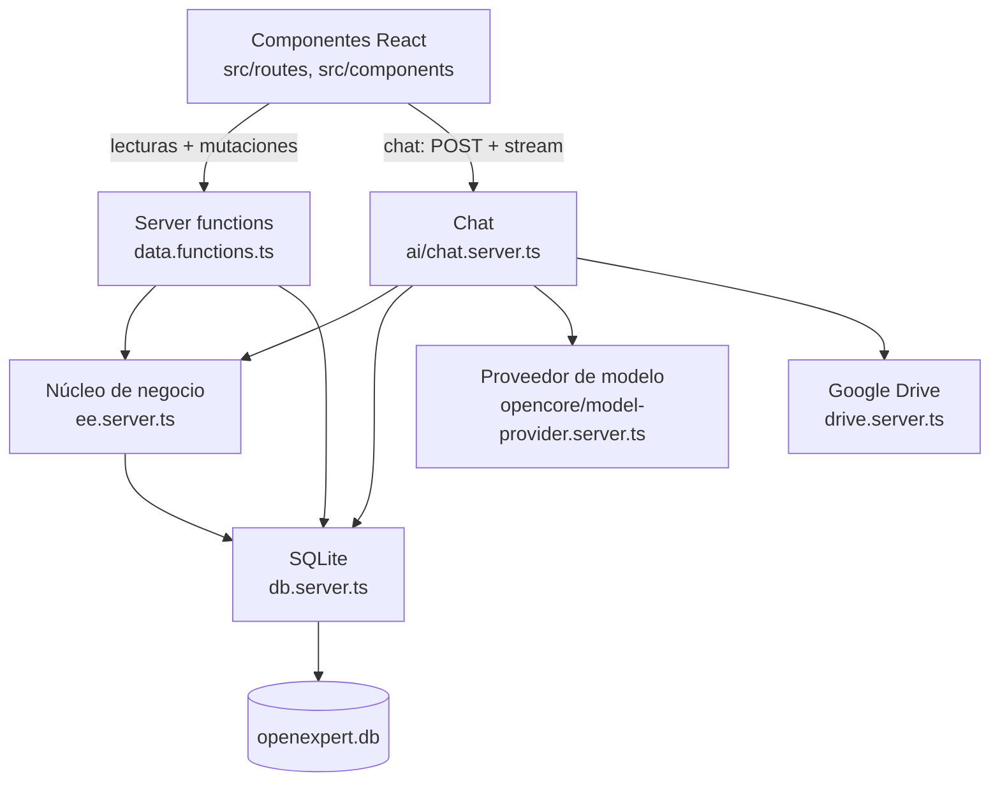
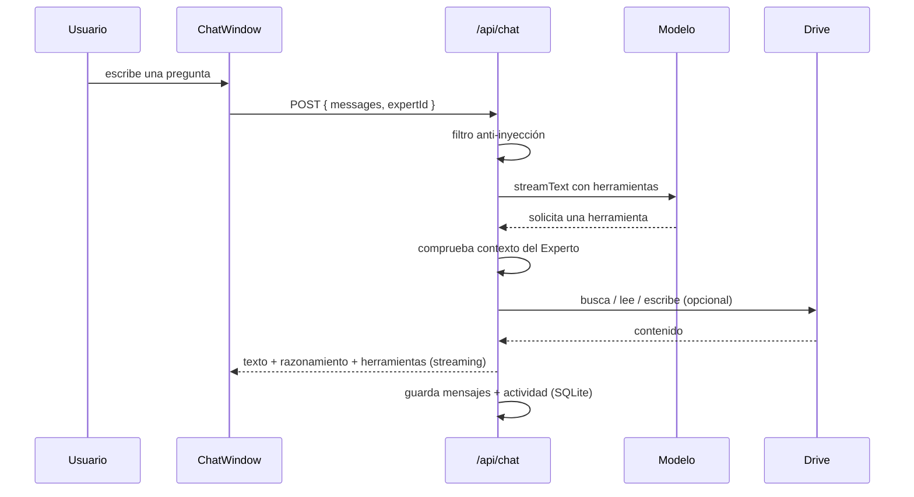

# 02 · Arquitectura

> **Audiencia:** equipo de ingeniería.

OpenExpert es una aplicación **local-first**: todo se ejecuta en tu equipo. No
hay nube, ni servidor de base de datos, ni inicio de sesión.

---

## 1. Stack

| Capa          | Tecnología                                                 | Función                                              |
| ------------- | ---------------------------------------------------------- | ---------------------------------------------------- |
| Aplicación    | TanStack Start (React 19, rutas por fichero, SSR)          | Renderizado, navegación, server functions            |
| Build         | Vite                                                       | Entorno de desarrollo y build                        |
| Estilos       | Tailwind CSS 4 + shadcn/ui                                 | Sistema visual                                       |
| Servidor      | Nitro (`node-server`)                                      | Runtime del servidor construido                      |
| Base de datos | SQLite vía `sql.js`                                        | Fichero único en `OPENEXPERT_DATA_DIR/openexpert.db` |
| ORM           | Drizzle ORM (`sql-js`)                                     | Consultas tipadas; esquema en `drizzle/schema.ts`    |
| IA            | Vercel AI SDK (`ai`) + `@ai-sdk/google` / `@ai-sdk/openai` | Chat, herramientas, streaming                        |
| Modelo        | Ollama (defecto), Gemini o endpoint OpenAI-compatible      | Razonamiento y respuestas                            |
| Documentos    | API de Google Drive (opcional)                             | Lectura/escritura de ficheros del propietario        |

## 2. Capas y dirección de dependencia



**Reglas:** los módulos `.server.ts` nunca llegan al navegador. Todas las
lecturas y escrituras pasan por server functions; no hay acceso directo del
navegador a la base de datos.

## 3. Estructura de carpetas

```
src/
├── routes/                     Rutas de TanStack Router
│   ├── __root.tsx              Armazón
│   ├── index.tsx               / → redirige a /expert
│   ├── auth.google.callback.ts Retorno OAuth de Drive
│   ├── api/chat.ts             Endpoint de streaming del chat
│   └── _authenticated/         Grupo de layout (sin guardia de sesión)
├── lib/
│   ├── db.server.ts            Apertura SQLite + esquema + semilla
│   ├── data.functions.ts       Server functions (puerta única de escritura)
│   ├── ee.server.ts            Auditoría, reversión, consultas de negocio
│   ├── ai/chat.server.ts       Chat: herramientas, anti-inyección, streaming
│   ├── drive.server.ts         Cliente de Google Drive API
│   ├── drive-tokens.server.ts  OAuth de Drive y ciclo de tokens
│   └── opencore/               Proveedor de modelo + credenciales locales
├── components/                 AppShell y shadcn/ui
drizzle/
├── schema.ts                   Esquema SQLite tipado (Drizzle)
└── init.sql                    DDL aplicado al arrancar
packages/opencore/              Motor MIT + CLI
```

## 4. Flujo de una mutación

1. Un componente React llama a una server function de `data.functions.ts`.
2. El handler escribe en SQLite vía `db.server.ts` y llama a `persist()`.
3. Registra un evento en `activity` (con snapshot de las filas previas) vía `ee.server.ts`.
4. El cliente invalida la consulta del workspace y recarga.

No hay RLS: la aplicación es de propietario único, así que la autorización es
trivial y vive en el código. La reversión reproduce el snapshot del registro.

## 5. Flujo de un mensaje de chat



## 6. Decisiones de diseño

| Decisión                               | Fundamento                                                                     |
| -------------------------------------- | ------------------------------------------------------------------------------ |
| SQLite vía `sql.js`                    | Sin build nativo, funciona en cualquier Node; base de datos de un solo fichero |
| `init.sql` a mano + esquema Drizzle    | Esquema simple y transparente; sin herramientas de migración en runtime        |
| Escrituras solo vía server functions   | Un único punto de persistencia y auditoría                                     |
| El motor de IA no escribe directamente | Las acciones usan `propose_*` y requieren aprobación                           |
| Puerto 3000 fijo                       | La URI de redirección OAuth de Drive depende de él                             |

## 7. Referencias

- [Modelo de datos](./03-modelo-de-datos.md) — tablas SQLite.
- [Seguridad y acceso](./04-seguridad-y-acceso.md) — propietario único y secretos.
- [IA](./05-inteligencia-artificial.md) — herramientas.
- [Desarrollo](./07-desarrollo.md) — entorno.
