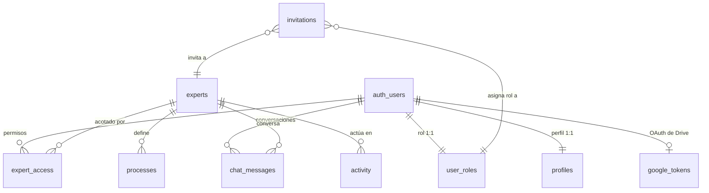

# 03 · Modelo de datos

> **Audiencia:** equipo de ingeniería. Las secciones 2 y 3 describen el modelo de negocio sin requerir lectura de código.

---

## 1. Resumen

Base de datos PostgreSQL única, organizada en cuatro bloques funcionales:

| Bloque    | Tablas                                                   | Función                                      |
| --------- | -------------------------------------------------------- | -------------------------------------------- |
| Identidad | `profiles`, `user_roles`, `invitations`, `expert_access` | Identidad, rol y visibilidad por usuario     |
| Contenido | `experts`, `processes`, `integrations`, `chat_messages`  | Expertos, procesos, fuentes y conversaciones |
| Operación | `deals`, `invoices`, `campaigns`, `accounts`, `activity` | Datos de negocio y registro de actividad     |
| Seguridad | `google_tokens`                                          | Credenciales OAuth por usuario               |

> Nota sobre el modo local: cuando `OPENEXPERT_MODE=local` (OpenCore, `packages/opencore/`), la persistencia se realiza en ficheros locales en lugar de PostgreSQL. El presente documento describe el esquema del modo cloud.

## 2. Diagrama de relaciones

## 3. Descripción de tablas

### 3.1. Identidad y acceso

#### `profiles` — identidad de la persona usuaria

| Columna      | Tipo          | Notas                                                                            |
| ------------ | ------------- | -------------------------------------------------------------------------------- |
| `id`         | `uuid`        | Clave primaria. Corresponde al `id` en `auth.users`                              |
| `name`       | `text`        | Nombre visible. Se deriva del perfil de Google si no se definió en la invitación |
| `email`      | `text`        | Correo de la cuenta de Google                                                    |
| `title`      | `text`        | Puesto o etiqueta. Valor por defecto: «Miembro»                                  |
| `created_at` | `timestamptz` | Fecha de alta                                                                    |

La tabla es poblada exclusivamente por el trigger `handle_new_user`. La ausencia de fila en esta tabla implica denegación de acceso a la aplicación.

#### `user_roles` — rol general

| Columna   | Tipo       | Valores                          |
| --------- | ---------- | -------------------------------- |
| `user_id` | `uuid`     | Referencia a `profiles`          |
| `role`    | `app_role` | `ADMIN`, `INTERMEDIO` o `LECTOR` |

Una fila por persona. El rol establece el nivel máximo de permisos; los permisos específicos por Experto se definen en `expert_access`.

#### `expert_access` — permiso por Experto

| Columna     | Tipo   | Valores                 |
| ----------- | ------ | ----------------------- |
| `user_id`   | `uuid` | Persona usuaria         |
| `expert_id` | `text` | Experto                 |
| `access`    | `text` | `none`, `read` o `exec` |

Una fila por persona y Experto. Este nivel determina la visibilidad de un Experto y la capacidad de ejecutar acciones sobre él.

#### `invitations` — invitaciones pendientes

| Columna      | Tipo          | Notas                                  |
| ------------ | ------------- | -------------------------------------- |
| `email`      | `text`        | Único. Normalizado a minúsculas        |
| `name`       | `text`        | Nombre visible dentro de la aplicación |
| `title`      | `text`        | Puesto                                 |
| `role`       | `app_role`    | Rol asignado al aceptar la invitación  |
| `expert_id`  | `text`        | Experto al que se concede acceso       |
| `created_at` | `timestamptz` | Fecha de emisión                       |

**La invitación es de un solo uso**: el trigger la elimina cuando la persona accede por primera vez.

#### `google_tokens` — credenciales de Drive

| Columna         | Tipo          | Notas                                                      |
| --------------- | ------------- | ---------------------------------------------------------- |
| `user_id`       | `uuid`        | Clave primaria. Una fila por persona                       |
| `access_token`  | `text`        | Token de corta duración, con renovación automática         |
| `refresh_token` | `text`        | Token de larga duración. Constituye la credencial efectiva |
| `expires_at`    | `timestamptz` | Expiración del access token                                |
| `scopes`        | `text`        | Permisos concedidos por el usuario                         |
| `updated_at`    | `timestamptz` | Última actualización                                       |

**RLS activo sin ninguna política de usuario**: la tabla resulta invisible incluso para el propio titular. Solo la service role puede leerla y escribirla. Su contenido nunca se expone al navegador. En modo local, las credenciales se almacenan en `credentials.json` (permiso `0600`) bajo el directorio de datos local.

### 3.2. Contenido

#### `experts` — Expertos

| Columna       | Tipo          | Notas                                                                  |
| ------------- | ------------- | ---------------------------------------------------------------------- |
| `id`          | `text`        | Clave primaria. Identificador legible (`general`, `ventas`, …)         |
| `name`        | `text`        | Nombre visible                                                         |
| `description` | `text`        | Se inyecta en el prompt del sistema: define la identidad del asistente |
| `sources`     | `text[]`      | Conectores autorizados. Un Experto sin `gdrive` no accede a Drive      |
| `created_at`  | `timestamptz` | —                                                                      |

#### `processes` — procesos autónomos

| Columna       | Tipo          | Notas                                                                      |
| ------------- | ------------- | -------------------------------------------------------------------------- |
| `id`          | `text`        | Prefijo `p-` + nombre corto                                                |
| `name`        | `text`        | —                                                                          |
| `description` | `text`        | —                                                                          |
| `trigger`     | `text`        | Condición de disparo, en texto descriptivo (p. ej. «Cron · viernes 17:00») |
| `stages`      | `text[]`      | Etapas, mostradas al solicitar la ejecución                                |
| `limits`      | `text[]`      | Límites declarados                                                         |
| `approval`    | `text`        | `Ninguna`, `Requerida` o `Doble firma`                                     |
| `expert_id`   | `text`        | Experto al que pertenece                                                   |
| `active`      | `boolean`     | Un proceso desactivado no puede ejecutarse                                 |
| `runs`        | `integer`     | Contador de ejecuciones                                                    |
| `last_run`    | `timestamptz` | —                                                                          |

> `trigger` es texto descriptivo, no un temporizador efectivo. Los procesos se ejecutan a demanda o desde una tarjeta de aprobación.

#### `integrations` — catálogo de conectores

| Columna     | Tipo          | Notas                                                                |
| ----------- | ------------- | -------------------------------------------------------------------- |
| `id`        | `text`        | `gdrive`, `pipedrive`, `holded`, …                                   |
| `name`      | `text`        | Nombre visible                                                       |
| `category`  | `text`        | CRM, ERP / Finanzas, Publicidad, Productividad                       |
| `connected` | `boolean`     | Estado. Únicamente `gdrive` admite valor `true` en la versión actual |
| `entities`  | `jsonb`       | Recuento de elementos de la última sincronización                    |
| `last_sync` | `timestamptz` | —                                                                    |

#### `chat_messages` — conversaciones

| Columna           | Tipo          | Notas                                                           |
| ----------------- | ------------- | --------------------------------------------------------------- |
| `id`              | `uuid`        | Generado automáticamente                                        |
| `user_id`         | `uuid`        | Autoría. Cada usuario accede únicamente a sus propios mensajes  |
| `expert_id`       | `text`        | Experto de la conversación                                      |
| `conversation_id` | `text`        | Agrupación de mensajes de un hilo. Valor por defecto: `default` |
| `message`         | `jsonb`       | Mensaje completo con sus partes de texto y de herramienta       |
| `created_at`      | `timestamptz` | —                                                               |

**Retención: 30 días.** La función `listConversations` elimina los hilos con antigüedad superior a 30 días al listar el historial de un Experto.

### 3.3. Operación

#### `activity` — registro de actividad

Tabla central desde la perspectiva de control y auditoría.

| Columna       | Tipo          | Notas                                                                                   |
| ------------- | ------------- | --------------------------------------------------------------------------------------- |
| `id`          | `text`        | Prefijo `evt_` + 8 caracteres aleatorios                                                |
| `ts`          | `timestamptz` | Por defecto la fecha actual                                                             |
| `actor`       | `text`        | `human` o `agent`                                                                       |
| `actor_name`  | `text`        | Nombre de la persona, o identificador del asistente                                     |
| `type`        | `text`        | `Configuración`, `Consulta`, `Integración`, `Seguridad`, …                              |
| `expert_id`   | `text`        | Experto afectado. Valor por defecto: `general`                                          |
| `status`      | `text`        | `ok`, `pending`, `denied`, `failed`, `reverted`                                         |
| `summary`     | `text`        | Descripción en una frase legible                                                        |
| `sources`     | `text[]`      | Fuentes de la información                                                               |
| `duration_ms` | `integer`     | Duración                                                                                |
| `snapshot`    | `jsonb`       | Dos variantes: `entries` (filas previas, para reversión) o `pending` (acción pendiente) |

#### Tablas de negocio

Pobladas por las fuentes externas correspondientes.

| Tabla       | Entidad                | Campos relevantes                                                             |
| ----------- | ---------------------- | ----------------------------------------------------------------------------- |
| `deals`     | Oportunidades del CRM  | `company`, `stage`, `value`, `owner`, `days_in_stage`, `close_date`, `status` |
| `invoices`  | Facturas del ERP       | `client`, `amount`, `due_date`, `status`, `reminders`                         |
| `campaigns` | Campañas publicitarias | `channel`, `spend_7d`, `conversions_7d`, `cpa_target`, `daily_budget`         |
| `accounts`  | Cuentas cliente        | `mrr`, `usage_trend`, `open_tickets`, `churn_risk`                            |

Estas tablas no se editan desde la interfaz, con la excepción de `reminders` (contador de recordatorios de cobro), que se actualiza al aprobar una acción del asistente.

## 4. Tablas eliminadas (modelo anterior)

El concepto de Experto tuvo dos representaciones sucesivas en el esquema. Entre las migraciones `0004` y `0010` coexistieron ambas versiones con triggers de sincronización. La migración `0010` retiró por completo la versión anterior: tablas, columnas, triggers, funciones de sincronía e índices asociados. `expert_id` es actualmente `NOT NULL` con valor por defecto `general`.

## 5. Seguridad a nivel de base de datos

Todas las tablas tienen RLS activo. Las políticas son de solo lectura, salvo tres excepciones puntuales:

| Tabla             | Política              | Operación | Condición                     |
| ----------------- | --------------------- | --------- | ----------------------------- |
| Tablas de negocio | `members read`        | `SELECT`  | Cualquier miembro autenticado |
| `chat_messages`   | `own messages read`   | `SELECT`  | `user_id = auth.uid()`        |
| `chat_messages`   | `own messages insert` | `INSERT`  | `user_id = auth.uid()`        |
| `chat_messages`   | `own messages delete` | `DELETE`  | `user_id = auth.uid()`        |
| `profiles`        | `own profile update`  | `UPDATE`  | `id = auth.uid()`             |
| `google_tokens`   | **ninguna**           | —         | Solo service role             |

Este diseño es intencionado: la segmentación por Experto la aplica la capa de aplicación (`ee.server.ts`). Ver el análisis en [04-seguridad-y-acceso §7](./04-seguridad-y-acceso.md#7-límites-conocidos-del-modelo).

## 6. Funciones

| Función                        | Tipo                 | Función                                                                             |
| ------------------------------ | -------------------- | ----------------------------------------------------------------------------------- |
| `handle_new_user`              | trigger              | Aplica el control de acceso: valida proveedor y correo, crea perfil, rol y permisos |
| `has_role(uuid, app_role)`     | función              | Comprueba si un usuario ostenta un rol determinado                                  |
| `normalise_auth_user_tokens()` | trigger              | Normaliza a cadena vacía los tokens de `auth.users`                                 |
| `rls_auto_enable()`            | función de migración | Utilidad de migración para activar RLS                                              |

### Consideración sobre `auth.users`

El servicio de autenticación interpreta cinco columnas de `auth.users` como cadenas no nulas. Si alguna contiene `NULL`, la API de administración responde con error 500. El trigger `normalise_auth_user_tokens()` normaliza dichas columnas a cadena vacía y no debe omitirse.

## 7. Migraciones

Once ficheros SQL en `drizzle/migrations/`, aplicados y verificados:

| N.º  | Fichero                              | Contenido                                                     |
| ---- | ------------------------------------ | ------------------------------------------------------------- |
| 0000 | `expertengine_core.sql`              | Esquema completo, RLS, políticas y funciones base             |
| 0001 | `reset_demo_fn.sql`                  | Función de carga de datos de demostración (retirada en 0009)  |
| 0002 | `restrict_signup_single_email.sql`   | Acceso restringido a invitación                               |
| 0003 | `chat_conversations.sql`             | Hilos de conversación en el chat                              |
| 0004 | `add_experts_compatibility.sql`      | `experts` y `expert_access` junto al modelo anterior          |
| 0005 | `expert_context_insert_defaults.sql` | Valores por defecto de `expert_id` en inserciones             |
| 0006 | `allow_invited_users.sql`            | El trigger acepta invitaciones además del propietario inicial |
| 0007 | `google_drive_tokens.sql`            | Tabla `google_tokens` sin políticas de usuario                |
| 0008 | `normalise_auth_user_tokens.sql`     | Trigger de normalización de `auth.users`                      |
| 0009 | `drop_reset_demo.sql`                | Retirada de `reset_demo()`, sin uso                           |
| 0010 | `drop_legacy_mirrors.sql`            | Retirada del modelo anterior                                  |

El procedimiento para añadir una migración se describe en [07-desarrollo §5](./07-desarrollo.md#5-migraciones).
