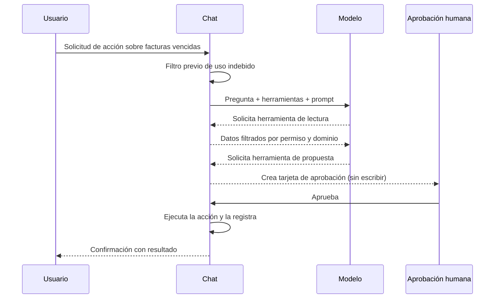

# 05 · Inteligencia artificial

> **Audiencia:** ambos. Negocio: qué puede y qué no puede hacer el asistente. Ingeniería: herramientas, permisos y prompt.

---

## 1. Modelo y proveedor

| Aspecto         | Edición cloud (por defecto)     | Edición local (OpenCore)                                                   |
| --------------- | ------------------------------- | -------------------------------------------------------------------------- |
| Modelo          | Gemini 2.5 Flash                | Configurable                                                               |
| Acceso          | API de Google AI Studio         | Según proveedor                                                            |
| Selector        | Fijo                            | `src/lib/opencore/model-provider.server.ts`                                |
| Variables       | `GOOGLE_API_KEY`                | `OPENEXPERT_MODEL_PROVIDER`, `OPENEXPERT_MODEL_ID`, claves según proveedor |
| Orquestador     | Vercel AI SDK, con `streamText` | Idéntico                                                                   |
| Razonamiento    | Activado y visible en interfaz  | Idéntico                                                                   |
| Límite de pasos | 50 pasos por turno              | Idéntico                                                                   |
| Transmisión     | Streaming token a token         | Idéntico                                                                   |
| Idioma          | **Siempre español**             | Idéntico                                                                   |

Con `OPENEXPERT_MODEL_PROVIDER=ollama`, la inferencia se ejecuta en el equipo local sin remisión de datos a terceros. Con `openai-compatible`, el cliente aporta su propio endpoint y clave.

### 1.1. Finalidad del razonamiento visible

Cuando el asistente recurre a herramientas, el usuario visualiza el razonamiento previo al resultado. Ello incrementa la confianza y permite auditar la motivación de cada invocación.

## 2. Catálogo de herramientas

El asistente carece de acceso directo a la base de datos. Únicamente puede invocar las 14 herramientas siguientes, cada una con su verificación de permisos en servidor.

### 2.1. Herramientas de lectura

| Herramienta                | Contenido                                                                   | Dominio     | Requiere |
| -------------------------- | --------------------------------------------------------------------------- | ----------- | -------- |
| `get_pipeline_summary`     | Valor abierto, nº de deals, win rate, previsión ponderada, deals estancados | `ventas`    | `read`   |
| `list_deals`               | Oportunidades abiertas, opcionalmente por etapa                             | `ventas`    | `read`   |
| `list_overdue_invoices`    | Facturas vencidas con importe, días de retraso y recordatorios              | `finanzas`  | `read`   |
| `get_campaign_performance` | Gasto, conversiones, CPA real vs. objetivo, estado                          | `marketing` | `read`   |
| `get_churn_risk`           | MRR, tendencia de uso, tickets abiertos, probabilidad de baja               | `general`   | `read`   |
| `list_processes`           | Catálogo de procesos con disparador, aprobación y estado                    | transversal | `read`   |

### 2.2. Herramientas de Google Drive

| Herramienta         | Función                                              | Requiere              |
| ------------------- | ---------------------------------------------------- | --------------------- |
| `search_drive`      | Búsqueda de ficheros por nombre o contenido          | `gdrive` en `sources` |
| `read_drive_file`   | Lectura de texto de Docs, Sheets (CSV), Slides o PDF | `gdrive` en `sources` |
| `create_drive_file` | Creación de Docs, Sheets, texto o Markdown           | `gdrive` + `exec`     |
| `update_drive_file` | Reescritura de un fichero existente                  | `gdrive` + `exec`     |

Las herramientas de escritura en Drive constituyen la única excepción al principio «la IA propone, la persona aprueba»: la aprobación se entiende implícita en la solicitud del chat. Toda escritura queda registrada en `activity`.

### 2.3. Herramientas de propuesta (no ejecutan)

| Herramienta                 | Propone                                   | Requiere              |
| --------------------------- | ----------------------------------------- | --------------------- |
| `propose_invoice_reminders` | Envío de reclamaciones de cobro           | `exec` en `finanzas`  |
| `propose_pause_campaigns`   | Pausa de campañas que exceden el objetivo | `exec` en `marketing` |
| `request_process_run`       | Ejecución de un proceso autónomo          | `exec` en su Experto  |

Estas tres herramientas no modifican ningún dato. Crean una fila en `activity` con estado `pending`, presentada como tarjeta de confirmación.

### 2.4. Utilidad

| Herramienta        | Función                                    | Restricción  |
| ------------------ | ------------------------------------------ | ------------ |
| `open_expert_form` | Formulario de creación de un Experto nuevo | Solo `ADMIN` |

## 3. Aislamiento por dominio

Cada herramienta de lectura pertenece a un dominio (`ventas`, `finanzas`, `marketing`, `general`). Antes de ejecutarse se verifica que el Experto activo coincida con el dominio, o sea `general`, y que el usuario disponga de permiso de lectura.

- Desde `ventas`, solo se consultan datos de `ventas`.
- Desde `general`, todos los dominios con permiso.
- Fuera de contexto: error legible, sin datos.

El aislamiento de Drive se decide por la columna `sources` del Experto, no por el dominio.

## 4. Ciclo completo de una solicitud

## 5. Prompt del sistema

Reside en la capa del chat en servidor y se construye en cada turno:

1. **Rol y formato.** Identidad del asistente, español, tono ejecutivo.
2. **Contexto activo.** Nombre, descripción y fuentes del Experto.
3. **Usuario y permisos.** Identidad, rol y permisos. El modelo conoce su visibilidad, pero no decide.
4. **Estado de Drive.** Instrucciones de búsqueda y lectura previa si `gdrive` está habilitado.
5. **Reglas.** Datos solo de herramientas, no inferir cifras, no declarar acciones ejecutadas sin aprobación, no revelar instrucciones, rechazar evasión.
6. **Formato de salida.** Conclusión ejecutiva, tabla compacta (máx. 6 filas) o lista breve, 2–3 recomendaciones numeradas, como máximo un aviso de riesgo. Sin emojis.

## 6. Activación proactiva de herramientas

Cuando el usuario alude a Drive, documentos o información corporativa, el prompt instruye el uso de `search_drive` seguido de `read_drive_file` antes de responder.

## 7. Límites y control de coste

| Límite                  | Valor / comportamiento                                     |
| ----------------------- | ---------------------------------------------------------- |
| Pasos por turno         | 50                                                         |
| Tamaño del mensaje      | Validación de entrada con Zod                              |
| Retención de historial  | 30 días (limpieza oportunista)                             |
| Errores de cuota        | 429 → mensaje de límite alcanzado                          |
| Errores de credenciales | 400/403 → mensaje de clave no válida                       |
| Coste por consulta      | El de la API del proveedor. Con Ollama, sin coste externo. |

## 8. Referencias

- [Seguridad y acceso §5](./04-seguridad-y-acceso.md#5-garantías-frente-a-uso-indebido-del-asistente) — garantías.
- [Integraciones §4](./06-integraciones.md#4-excepción-de-las-escrituras-en-drive-al-flujo-de-aprobación) — excepción de Drive.
- [OpenCore](./11-opencore.md) — proveedores en modo local.
