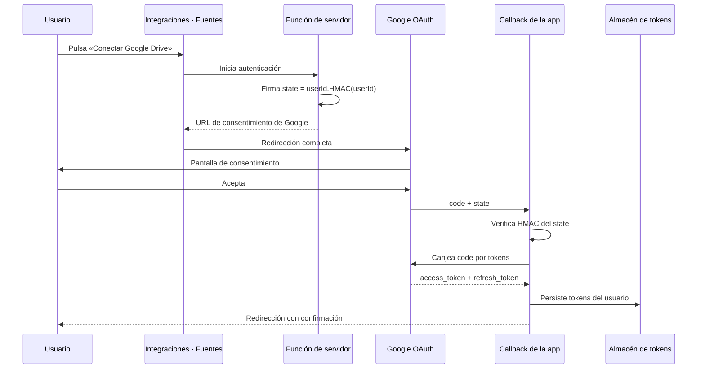

# 06 · Integraciones

> **Audiencia:** ambos. Negocio: qué está conectado y qué cuesta conectarlo. Ingeniería: procedimiento.

---

## 1. Estado de cada conector

De las ocho integraciones previstas, **únicamente Google Drive se encuentra conectada**. Las restantes están modeladas a nivel de datos pero pendientes de credenciales.

| Integración      | Categoría      | Conexión     | Estado                | Coste para el cliente                                 |
| ---------------- | -------------- | ------------ | --------------------- | ----------------------------------------------------- |
| **Google Drive** | Productividad  | OAuth        | **Conectada**         | Sin coste (no requiere Workspace)                     |
| Pipedrive        | CRM            | Por licencia | Preparada, sin claves | Requiere licencia del cliente                         |
| Salesforce       | CRM            | Por licencia | Preparada, sin claves | Requiere licencia + API de monitorización             |
| Holded           | ERP / Finanzas | Por licencia | Preparada, sin claves | Requiere plan de pago                                 |
| Gmail            | Productividad  | OAuth        | Preparada, sin claves | Sin coste; requiere habilitación de la API            |
| Slack            | Productividad  | OAuth        | Preparada, sin claves | Sin coste                                             |
| Google Analytics | Publicidad     | OAuth        | Preparada, sin claves | Sin coste; con cuota por propiedad                    |
| Meta Ads         | Publicidad     | Token        | Preparada, sin claves | Requiere cuenta publicitaria; token de larga duración |

## 2. Google Drive: funcionamiento

### 2.1. Diseño: OAuth por usuario, sin cuenta de servicio

Cada persona conecta **su propia** cuenta de Google desde _Integraciones → Fuentes_. No existe cuenta de servicio compartida ni token global.

### 2.2. Flujo paso a paso

### 2.3. Permisos solicitados

| Scope            | Finalidad                      |
| ---------------- | ------------------------------ |
| `drive.readonly` | Búsqueda y lectura de ficheros |
| `drive.file`     | Creación y edición de ficheros |

No se solicita acceso total. `drive.file` otorga permiso exclusivamente sobre ficheros creados por la propia aplicación.

### 2.4. Seguridad de los tokens

- **Parámetro `state` firmado** con HMAC-SHA256. Ningún token de sesión viaja en la URL.
- **Los tokens no abandonan el servidor.** En cloud residen en `google_tokens` (RLS activa, sin políticas de usuario). En local, en `credentials.json` (permisos `0600`).
- **Refresco perezoso y transparente.** Se reutiliza el `access_token` con más de un minuto de vigencia; en caso contrario se canjea el `refresh_token`. Se conserva el anterior si Google omite el nuevo.
- **La desconexión revoca en Google** mediante el endpoint de revocación.

### 2.5. Estado del consentimiento: «In production»

- En estado **Testing**, Google emite el `refresh_token` con **7 días de caducidad**. Obligaría a reconectar semanalmente.
- En estado **In production**, la limitación desaparece (aviso de app no verificada y tope de 100 usuarios, sin impacto para el uso previsto).

La verificación formal no es necesaria para uso personal o en pruebas. Ver [08-despliegue §4](./08-despliegue.md#4-cliente-oauth-de-google).

## 3. Incorporación de una nueva integración

### 3.1. Nivel de modelo (completado para las ocho previstas)

1. Fila en `integrations` con su categoría.
2. Inclusión del identificador en `sources` de los Expertos autorizados.
3. Creación de la tabla destino mediante migración.

### 3.2. Nivel de conector

1. **Credenciales.** Documentar el flujo OAuth o los requisitos de plan.
2. **Tokens.** En OAuth por usuario, reutilizar el patrón de Drive. Con clave de servicio, custodiarla en variable de entorno.
3. **Cliente de API.** Módulo de servidor que reciba siempre el identificador de usuario.
4. **Sincronización.** Función que pueble la tabla destino y actualice estado.
5. **Herramientas de IA.** Funciones de lectura con verificación de dominio y registro de fuentes.

### 3.3. Lista de verificación

- ¿El acceso figura en `sources` del Experto?
- ¿La herramienta verifica permisos antes de leer?
- ¿Las escrituras requieren tarjeta de aprobación?
- ¿La credencial reside en variable de entorno?

## 4. Excepción de las escrituras en Drive al flujo de aprobación

La creación y edición de documentos no requiere tarjeta previa: **carecen de efectos fuera de Google Drive**. La aprobación se entiende implícita en la solicitud del chat. Toda escritura queda registrada en `activity`. Las acciones con efecto externo siempre requieren tarjeta.

## 5. Particularidades del modo local (OpenCore)

En modo local el chat opera sin cliente OAuth; las herramientas de Drive indican pendiente de conexión hasta aportarlo. Los tokens se custodian en el fichero local. El catálogo de herramientas y la exigencia de `gdrive` en `sources` se mantienen.

## Referencias

- [Arquitectura §5](./02-arquitectura.md#5-flujo-de-un-mensaje-de-chat) — herramientas e IA.
- [Inteligencia artificial §2](./05-inteligencia-artificial.md#2-catálogo-de-herramientas) — catálogo completo.
- [Despliegue §4](./08-despliegue.md#4-cliente-oauth-de-google) — URI de redirección.
